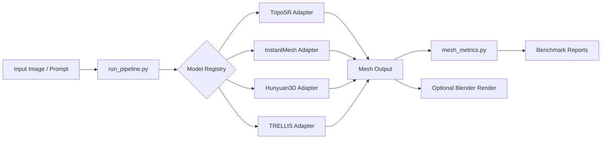

# 3DGenLab

3DGenLab is a modular portfolio project for orchestrating and benchmarking multiple open-source 3D generative AI models from a single Python pipeline.

## Motivation

The 3D generation ecosystem evolves quickly, and each model repository has its own setup and CLI conventions. This project provides a clean adapter-based scaffold to:

- standardize invocation interfaces,
- compare outputs across models,
- collect lightweight mesh quality metrics,
- prepare for future integration of full inference workflows.

## Pipeline Overview



## Supported / Planned Models

- **TripoSR** (image-to-3D)
- **InstantMesh** (image-to-3D)
- **Hunyuan3D-2.1** (image/text-to-3D)
- **TRELLIS** (image/text-to-3D)

> Current implementation uses dry-run adapters that generate placeholder OBJ outputs. Real inference commands are intentionally left as TODO integration points.

## Project Structure

```text
3DGenLab/
├── README.md
├── requirements.txt
├── .gitignore
├── configs/default.yaml
├── inputs/images/
├── inputs/prompts/
├── outputs/
├── external/
├── scripts/
└── src/genlab/
```

## Setup

```bash
python -m venv .venv
source .venv/bin/activate
pip install -r requirements.txt
```

(Optional) clone external repositories:

```bash
bash scripts/setup_external_repos.sh
```

## Run a Single Model (Dry-Run)

```bash
python scripts/run_pipeline.py --config configs/default.yaml --model triposr --dry-run
```

You can override inputs:

```bash
python scripts/run_pipeline.py \
  --config configs/default.yaml \
  --model trellis \
  --input inputs/images/example.png \
  --prompt inputs/prompts/example.txt \
  --dry-run --benchmark
```

## Run All Models (Dry-Run)

```bash
python scripts/run_all_models.py --config configs/default.yaml --dry-run
```

## Current Status

- ✅ Modular adapter scaffolding complete
- ✅ Registry-driven model selection
- ✅ Dry-run placeholder mesh generation
- ✅ Basic mesh benchmark metrics
- 🚧 Real model CLI integration (next)
- 🚧 Blender rendering workflow (placeholder)

## Roadmap

1. Add per-model real command execution wrappers.
2. Add reproducible environment setup for each external repo.
3. Add richer evaluation metrics (surface quality, normals, manifold checks).
4. Add batch experiment runner and report aggregation.
5. Add render previews and gallery generation.

## Disclaimer

This repository provides an integration and evaluation scaffold for external open-source models. It does **not** vend or repackage the upstream model code. Each integrated model remains subject to its original repository license and terms.
